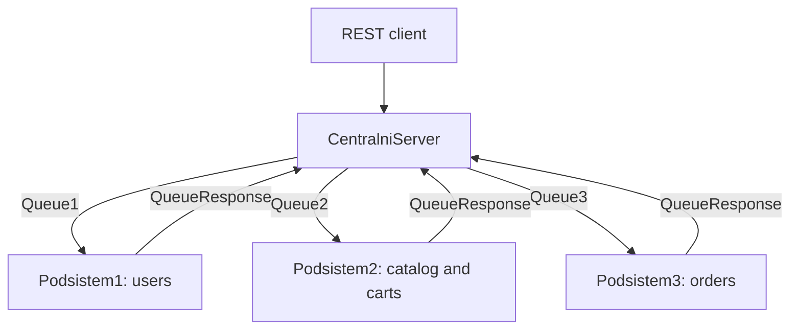

# Distributed Shopping System

A Java EE 8 shopping backend with a REST gateway and three JMS-connected subsystems. Features include users and balances, product categories, carts, wishlists, orders, and transactions.

## Architecture

| Module | Responsibility |
|---|---|
| `CentralniServer` | JAX-RS endpoints, JMS requests, correlation IDs, and replies |
| `Podsistem1` | Users, cities, roles, and balances |
| `Podsistem2` | Products, categories, carts, and wishlists |
| `Podsistem3` | Orders, order items, and transactions |

The gateway uses `jms/IS1Factory`, request queues `jms/Queue1` through `jms/Queue3`, and `jms/QueueResponse` for correlated replies.



Subsystem 3 also queries the other subsystems using temporary JMS reply queues during order processing. See the [REST endpoint reference](docs/API.md) for controller routes.

## Build

Requires JDK 8 or 11 and Maven. The root Maven reactor builds all four modules together.

```sh
mvn clean package
```

The gateway produces a WAR and the subsystems produce application-client JARs. The Maven build has not yet been run in this environment; it needs access to dependency repositories.

## Server setup

Use a compatible Java EE 8 application server, such as the GlassFish 5 environment used by the original NetBeans projects. Create the JMS connection factory and queues named above. Supply a compatible MySQL Connector/J driver to the application clients/server.

The database names in the original configuration are `podsistem1`, `podsistem2`, and `podsistem3`. Persistence configuration sets schema generation to `none`, so existing schemas are required. No complete schema migration or deployment automation was present in these source folders.

For each subsystem, copy `src/conf/persistence.xml.example` to `src/conf/persistence.xml` and replace `CHANGE_ME` locally. Real `persistence.xml` files are ignored by Git and are required before building a runnable deployment. Database usernames and passwords have been removed from the prepared configuration.

Deploy the gateway WAR, and launch each subsystem using the server's application-client container (`appclient -client <jar>`), rather than plain `java -jar`, because the source depends on injected JMS resources.

## Deployment verification

1. Configure the three existing database schemas and each local persistence file.
2. Create the JMS connection factory and four named queues.
3. Build the reactor, deploy the WAR, and start all three application clients.
4. Check the server/client logs for successful persistence and JMS initialization.
5. Exercise a read operation through the gateway, then a complete cart-to-order flow with synthetic users and products. Check both response payloads and resulting database records.

This sequence describes the integration work still required; it is not a record of a successful deployment.

## Limitations

This is coursework code. Authentication/authorization, password handling, transactions, response-queue consumption under concurrency, and failure recovery need review before production use. Some gateway requests wait five seconds for a response. End-to-end deployment and security have not been validated.

## Context

Educational project by [Marko Mijanovic](https://github.com/markomijanovic), University of Belgrade, School of Electrical Engineering. Supplied course scaffolding and assets retain their original licensing terms.

## Verification

- All four modules compile with JDK 8 and the Java EE 8 API.
- Maven packaging and live server/database/JMS integration have not been verified.
